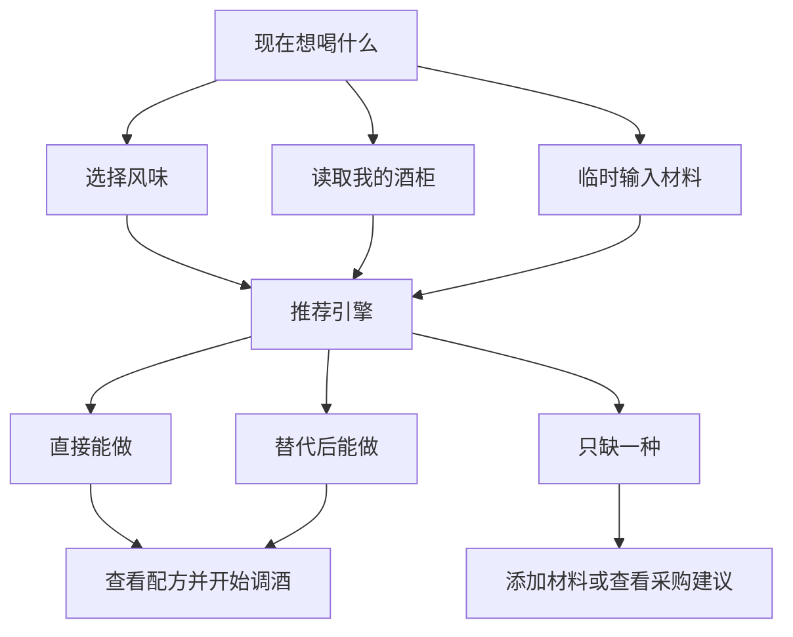

# 酒单 App 新增功能与业务流程总结

> 文档状态：产品规划总结  
> 当前依据：现有功能描述与本轮需求讨论  
> 说明：本文尚未读取本地 `drinks` 用户端和 `admin` 管理端代码，后续可结合实际页面、接口与数据结构进一步细化。

## 1. 产品升级目标

现有酒单 App 已具备推荐、酒单列表、创建公开/私人酒单、收藏和随机推荐等基础能力。下一阶段的核心目标，是把产品从“鸡尾酒配方库”升级为能够结合用户口味和家中材料给出可执行建议的“家庭调酒助手”。

核心推荐依据由单一的酒款名称或热门程度，升级为：

> 用户想喝的风味 + 家中现有材料 + 可信的材料替代方案

这套能力主要解决三个问题：

1. 用户不了解鸡尾酒名称，只知道自己想喝什么感觉。
2. 用户只有部分材料，不知道现在能够制作什么。
3. 用户缺少某种材料，不知道能否替代以及替代后如何调整配方。

## 2. 现有功能与新增功能

### 2.1 现有功能

- 首页推荐
- 酒单列表及详情
- 创建公开酒单
- 创建私人酒单
- 收藏
- 随机推荐

### 2.2 核心新增功能

| 新增功能 | 用户问题 | 核心能力 |
|---|---|---|
| 风味推荐 | 不懂酒名，不知道该选什么 | 根据清爽、酸甜、果香、酒精感、气泡感等偏好推荐 |
| 我的酒柜 | 不知道家中材料能做什么 | 记录已有材料并计算可制作配方 |
| 临时材料输入 | 不想维护酒柜，只想快速查询 | 临时勾选、搜索或输入手头材料 |
| 材料替代 | 缺少材料，不知道能否继续制作 | 给出替代品、换算比例、风味变化和调整方法 |
| 材料匹配分组 | 推荐结果太多且不可执行 | 分为直接能做、替代后能做、只缺一种、缺少两种以上 |
| 替代后完整配方 | 替换材料后原比例可能失衡 | 自动生成调整过用量的新版本配方 |
| 分步调酒 | 找到配方后仍不便操作 | 进入适合实际制作场景的逐步操作流程 |

## 3. 核心业务流程



完整用户流程如下：

1. 用户从首页进入“现在想喝什么”。
2. 用户选择使用方式：按风味推荐、读取我的酒柜或临时输入材料。
3. 用户可补充甜度、酒精感、气泡感、制作时间和指定材料等条件。
4. 系统同时计算风味匹配与材料匹配。
5. 推荐结果按可执行程度分组。
6. 用户进入配方详情，查看已有、缺少和可替代材料。
7. 如果发生替代，系统展示重新计算后的完整配方及风味变化。
8. 用户确认后进入分步调酒流程。
9. 后续可记录口味反馈，用于完善个人风味画像。

## 4. 风味推荐设计

### 4.1 面向普通用户的选择方式

第一层避免使用过多专业术语，提供直观风格：

- 清爽解渴
- 酸甜开胃
- 果香明显
- 茶香淡雅
- 浓郁顺滑
- 微苦成熟
- 酒感强烈
- 随便帮我选

第二层只保留少量关键条件：

- 甜度：不甜、微甜、明显甜
- 酒精感：轻松易饮、能喝到酒味、偏烈
- 口感：有气泡、无气泡顺口、浓郁慢饮
- 制作时间：如 3 分钟、5 分钟、10 分钟内
- 指定材料：可选，不强制

### 4.2 推荐结果展示

推荐卡片应优先告诉用户“喝起来是什么感觉”，再展示专业信息：

- 通俗风味描述
- 风味标签
- 酒精感等级
- 匹配度
- 制作难度和时间
- 材料状态
- 预计酒精度（可后续加入）

首页建议只突出三个结果：

1. 最符合风味且可以直接制作。
2. 风味稍有不同、适合探索的新酒款。
3. 替代一种材料后可制作的创意版本。

## 5. 我的酒柜与材料录入

### 5.1 MVP 记录范围

第一版不要求用户精确记录每瓶剩余毫升数，只需记录：

- 是否拥有该材料
- 是否开封（可选）
- 剩余状态：充足或不多（可选）
- 开封日期或保质期（可选）

### 5.2 材料分类

| 分类 | 示例 |
|---|---|
| 基酒 | 金酒、威士忌、白朗姆、波本 |
| 利口酒 | 君度、金巴利 |
| 葡萄酒类 | 甜味美思、干味美思 |
| 果汁与饮料 | 梨汁、葡萄汁、橙汁、气泡水 |
| 新鲜水果 | 柠檬、青柠、橙子、梨、蓝莓 |
| 茶与咖啡 | 茉莉花茶、薄荷茶、咖啡 |
| 甜味材料 | 白糖、蜂蜜、桂花蜜、糖浆 |
| 香料辅料 | 肉桂、盐、薄荷、苦精 |
| 工具 | 摇壶、量酒器、滤冰器、搅拌杯 |

### 5.3 添加方式

- 搜索后单击添加
- 按分类批量勾选常见材料
- 从配方详情反向加入酒柜
- 自然语言输入并二次确认（后续版本）
- 拍照识别酒瓶（非首版）

## 6. 推荐结果分组

| 分组 | 判断标准 | 展示策略 |
|---|---|---|
| 直接能做 | 已拥有全部必需材料 | 优先展示 |
| 替代后能做 | 缺少材料，但存在可靠替代方案 | 展示替代后的完整配方 |
| 只缺一种 | 仅缺少一种且无法合理替代 | 提示购买后可解锁的配方数量 |
| 缺少两种以上 | 当前执行成本较高 | 默认折叠 |

装饰物不应被当作必需材料。缺少一片橙皮或薄荷叶，不应导致系统判定整个配方无法制作。

## 7. 材料替代规则

### 7.1 替代等级

| 等级 | 含义 | 示例 |
|---|---|---|
| 很适合 | 可以放心替换，结构变化较小 | 单糖浆 → 蜂蜜糖浆 |
| 可以替换 | 可以完成制作，但风味会变化 | 青柠汁 → 黄柠檬汁 |
| 应急替换 | 可以饮用，但已不是原版风格 | 甜味美思 → 红葡萄酒加少量糖浆 |

无法合理替换时必须明确说明，不能为了增加“可制作数量”而给出不可信方案。

### 7.2 替代后的处理

替代不能只更换材料名称，还需要：

- 重新计算替代材料用量
- 必要时联动调整酸、甜或稀释比例
- 展示替代前后的风味变化
- 提供额外操作说明，例如先用温水化开蜂蜜
- 标记其属于可靠替代还是创意改编

### 7.3 替代数量限制

- 替换 1 种：正常推荐
- 替换 2 种：标记为“创意改编”
- 替换超过 2 种：降低推荐排名，不再作为原版配方展示

### 7.4 核心材料与辅助材料

核心材料决定酒款身份或结构，原则上不能随意替换，例如：

- Negroni 中的金巴利
- Martini 中的味美思
- Old Fashioned 中的基酒

辅助材料可以相对灵活，例如装饰物、糖浆类型、部分柑橘、水果、茶和苏打水品牌。

## 8. 对现有业务模块的影响

| 现有模块 | 需要新增或调整的能力 |
|---|---|
| 首页推荐 | 增加“现在想喝什么”“用我的酒柜推荐”和今日可直接制作 |
| 酒单列表 | 增加风味、可制作状态、难度和时间筛选 |
| 酒单详情 | 展示材料匹配、缺少材料、替代方案及替代后的完整配方 |
| 收藏 | 支持收藏原配方和用户自己的调整版本 |
| 随机推荐 | 从完全随机升级为在用户风味与现有材料范围内随机 |
| 创建酒单 | 材料增加必需性、配方作用和是否允许替代等字段 |
| 私人酒单 | 支持保存个人比例、替代版本和创意改编配方 |

现有功能无需推翻，新增能力应作为推荐、详情和创建流程的增强层逐步接入。

## 9. 数据结构要求

### 9.1 配方风味数据

每个配方应保存标准化风味值，例如：

```ts
interface FlavorProfile {
  sweetness: number;  // 甜度 0-5
  acidity: number;    // 酸度 0-5
  bitterness: number; // 苦度 0-5
  alcohol: number;    // 酒精感 0-5
  freshness: number;  // 清爽度 0-5
  richness: number;   // 浓郁度 0-5
  fruitiness: number; // 果香 0-5
  herbal: number;     // 草本感 0-5
  tea: number;        // 茶香 0-5
  sparkling: number;  // 气泡感 0-5
}
```

### 9.2 配方材料数据

```ts
interface RecipeIngredient {
  ingredientId: string;
  amount: number;
  unit: "ml" | "g" | "piece" | "dash" | "tsp";
  role:
    | "base"
    | "sweet"
    | "sour"
    | "bitter"
    | "dilution"
    | "aroma"
    | "garnish";
  required: boolean;
  allowSubstitution: boolean;
}
```

### 9.3 替代关系数据

```ts
interface IngredientSubstitution {
  originalIngredientId: string;
  substituteIngredientId: string;
  ratio: number;
  compatibility: "excellent" | "good" | "acceptable";
  flavorChanges: string[];
  adjustment?: string;
  restrictions?: string[];
}
```

后台还需要维护材料标准名称、别名、分类、风味属性、酒精度、替代限制和是否需要联动调整其他材料。

## 10. 推荐算法原则

首版无需使用复杂 AI，可采用透明、可解释的规则评分。

推荐总分可以由以下部分组成：

- 风味匹配：45%
- 材料匹配：35%
- 制作难度：10%
- 用户历史偏好：10%

新用户没有历史数据时，将最后一项权重重新分配。

材料匹配应按角色设置权重：

| 材料角色 | 建议权重 |
|---|---:|
| 核心基酒 | 3 |
| 主要风味材料 | 2 |
| 酸甜平衡材料 | 2 |
| 稀释材料 | 1 |
| 装饰材料 | 0.2 |

还可加入以下现实条件：

- 全部材料已有：加分
- 一次高质量替代：适当加分
- 需要复杂工具或耗时过长：扣分
- 能消耗即将过期材料：加分
- 用户曾喜欢相似风格：加分
- 与明确不喜欢的风味冲突：大幅降权

## 11. 后台管理需求

### 11.1 材料管理

- 标准名称及别名
- 分类
- 风味属性
- 是否含酒精及大致酒精度
- 常见替代品

### 11.2 配方管理

- 材料、用量和单位
- 必需或可选
- 材料在配方中的作用
- 是否允许替代
- 风味评分
- 制作难度、时间和工具
- 推荐场景

### 11.3 替代规则管理

- 原材料与替代材料
- 换算比例
- 适配等级
- 风味变化
- 调整说明及使用限制
- 是否联动调整其他材料
- 用户端替代配方预览

## 12. 版本规划

### V1：跑通核心闭环

- 酒柜材料添加与删除
- 配方材料标准化
- 基础风味筛选
- 直接能做、缺一种和结果分组
- 20～30 组常见替代关系

### V2：完善可信替代

- 替代比例
- 替代后的完整配方
- 风味变化说明
- 最多两种材料替换
- 配方结构校验
- 临时输入材料
- 自动选择最佳替代方案

### V3：形成个性化推荐

- 喝后口味反馈
- 用户风味画像
- 根据临期材料优先推荐
- 自然语言录入
- 智能采购建议
- 生成私人改编配方

## 13. 建议的 MVP 范围

最小闭环：

> 添加 5～10 种现有材料 → 选择想喝的风味 → 返回直接能做、替代后能做、只缺一种 → 查看调整后的完整配方 → 开始制作

建议首批数据量：

- 100～150 个配方
- 80～120 种标准材料
- 20～30 个通俗风味标签
- 30～50 组可靠替代关系
- 8～10 组核心材料不可替代规则

## 14. 后续结合现有项目的工作

待读取实际项目后，需要进一步完成：

1. 对照 `drinks` 的现有页面、路由、组件和状态管理，确定新增入口及复用范围。
2. 对照 `admin` 的配方、材料和酒单数据结构，形成字段迁移清单。
3. 标注现有接口可复用部分及需要新增的接口。
4. 把产品流程拆分为前端页面、后端服务、管理后台和数据初始化任务。
5. 根据当前代码完成按版本、页面和接口划分的开发任务清单。

## 15. 核心产品原则

> 不要为了扩大“能做的数量”而随意替换材料。系统必须清楚区分经典原版、可靠替代和创意改编。

只要把“风味选择 + 酒柜匹配 + 可信替代”这条核心链路做好，产品就不再只是提供配方，而是真正帮助不懂鸡尾酒名称的用户，利用家中现有材料完成一杯适合自己口味的酒。
